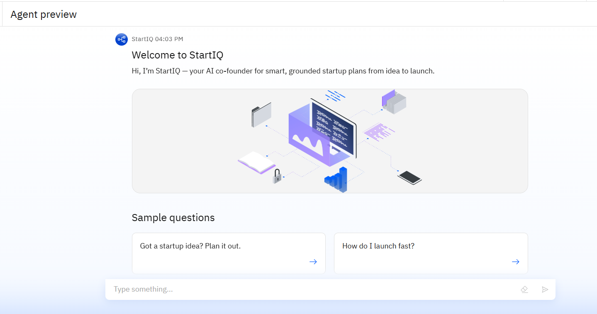
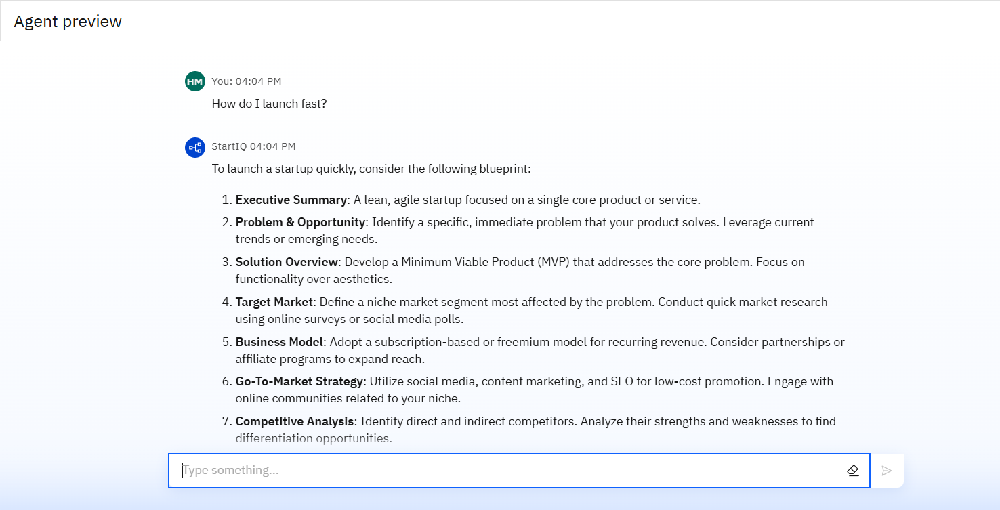
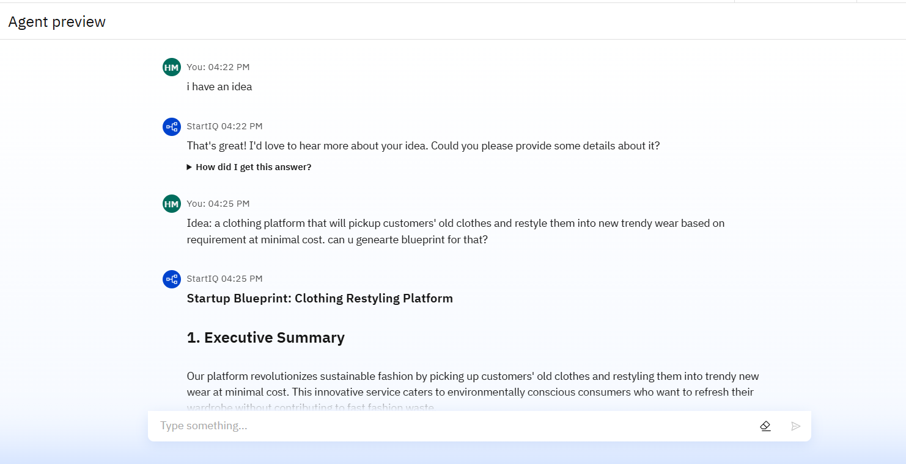
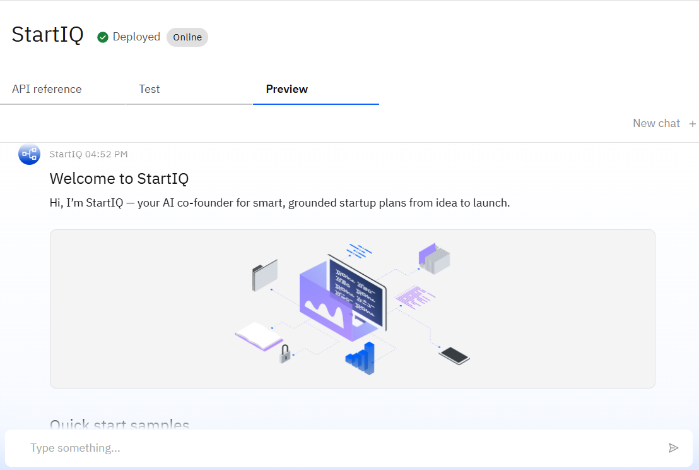

# 🚀 StartIQ — AI-Powered Startup Blueprint Generator

StartIQ is an AI-driven agent that helps founders turn raw startup ideas into complete, structured, and investor-ready business plans — in just minutes.

This project was developed as a **Capstone Project** by *Hitanshi Mehta*, Department of Information Technology, Government Engineering College, Gandhinagar.

---

## 🖼️ Screenshots

### 🧠 Home Interface

### 💬 Startup Input Interface

### 📄 Generated Blueprint Output

### 🧠 Deployment

---

## 📌 Problem Statement

Starting a business is hard — especially when you're unsure where to begin or how to create a solid plan. Most early founders don’t have access to expert guidance or proven startup strategies.

### 💡 Proposed Solution  
**StartIQ** uses Retrieval-Augmented Generation (RAG) to transform startup ideas into complete, actionable blueprints grounded in real startup knowledge.

---

## 🛠️ Technologies Used

- **IBM Cloud Services**
  - Watsonx.ai Studio
  - Watsonx.ai Runtime
  - IBM Cloud Agent Lab
  - Cloud Object Storage
  - IBM Granite Foundation Model
- **Core Concepts**
  - Natural Language Processing (NLP)
  - Retrieval-Augmented Generation (RAG)

---

## ✨ Key Features & Wow Factors

- 🧠 Builds full startup plans in minutes  
- 📚 Grounded in real-world startup data  
- 🗣️ Talks like a helpful co-founder — clear, friendly, practical  
- 🧩 Adapts to your idea, industry, and stage  
- 📄 Delivers investor-ready content  
- ⚡ Replaces templates and scattered research with instant smart advice

---

## 👥 End Users

- First-time founders  
- Solo entrepreneurs  
- Student innovators  
- Non-technical founders  
- Early-stage startup teams

---

## ✅ Results

- Functional, deployed AI agent (StartIQ)
- Successfully transforms user prompts into structured startup blueprints
- Demonstrated end-to-end flow using Watsonx, NLP, and RAG

---

## 🧠 Future Scope

- Plans based on founder personality and goals  
- Region and industry-specific guidance  
- One-click pitch deck generation  
- Smart matching with co-founders and mentors  
- Progress tracking and goal reminders  
- Live updates based on market trends

---

## 🎓 IBM Certifications

> This project was supported and validated using IBM Cloud and Watsonx services, as part of the IBM Internship program.

---

## 🔗 GitHub Repository

[https://github.com/codeHit-24/IBM_INTERNSHIP.git](https://github.com/codeHit-24/IBM_INTERNSHIP.git)

---

## 🔗 Linkedin

[www.linkedin.com/in/hitanshi-mehta-5010682b0](www.linkedin.com/in/hitanshi-mehta-5010682b0)

## 🙏 Thank You!

Have feedback or want to contribute? Reach out via GitHub or fork the project to experiment with your own ideas.
